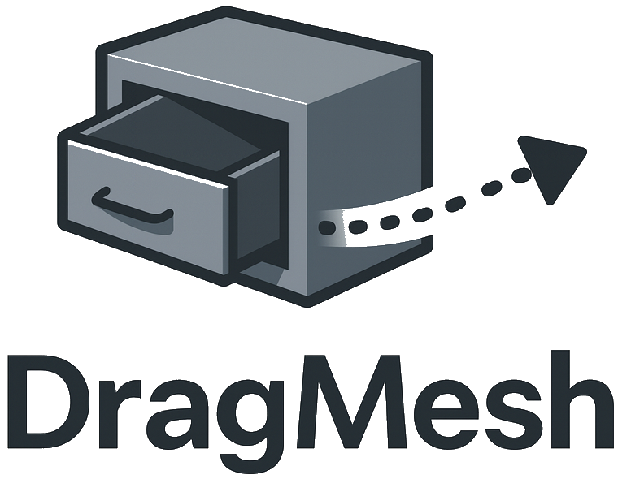
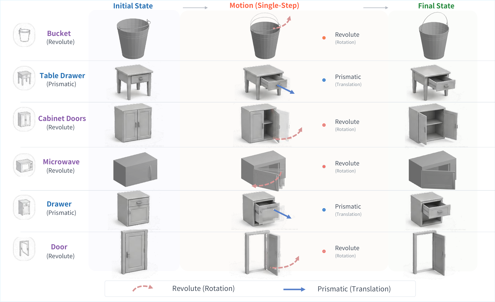

#  DragMesh: Interactive 3D Generation Made Easy

Official repository for the paper
> **DragMesh: Interactive 3D Generation Made Easy**.
>
> [Tianshan Zhang](https://neptune-t.github.io/aca-web-html/)\*, [Zeyu Zhang](https://steve-zeyu-zhang.github.io/)\*†, [Hao Tang](https://ha0tang.github.io/)<sup>#</sup>
>
> \*Equal contribution. †Project lead. <sup>#</sup>Corresponding author.
>
> ### [Paper](https://www.arxiv.org/abs/2512.06424) | [Website](https://aigeeksgroup.github.io/DragMesh) | [Models](https://huggingface.co/AIGeeksGroup/DragMesh) | [HF Paper](https://huggingface.co/papers/2512.06424)

> [!NOTE]
>  GAPartNet (link above) is the canonical dataset source for all articulated assets used in DragMesh.

## 📄 Teaser Presentation


https://github.com/user-attachments/assets/428b0d36-50ab-4b46-ab17-679ad22c826b


## 🧾 Citation
If you find DragMesh helpful, please cite:
```bibtex
@article{zhang2025dragmesh,
  title={DragMesh: Interactive 3D Generation Made Easy},
  author={Zhang, Tianshan and Zhang, Zeyu and Tang, Hao},
  journal={arXiv preprint arXiv:2512.06424},
  year={2025}
}
```

---

## ✨ Intro

While generative models have excelled at creating static 3D content, the pursuit of systems that understand how objects move and respond to interactions remains a fundamental challenge. Current methods for articulated motion lie at a crossroads: they are either physically consistent but too slow for real-time use, or generative but violate basic kinematic constraints. We present DragMesh, a robust framework for real-time interactive 3D articulation built around a lightweight motion generation core. Our core contribution is a novel decoupled kinematic reasoning and motion generation framework. First, we infer the latent joint parameters by decoupling semantic intent reasoning (which determines the joint type) from geometric regression (which determines the axis and origin using our Kinematics Prediction Network (KPP-Net)). Second, to leverage the compact, continuous, and singularity-free properties of dual quaternions for representing rigid body motion, we develop a novel Dual Quaternion VAE (DQ-VAE). This DQ-VAE receives these predicted priors, along with the original user drag, to generate a complete, plausible motion trajectory. To ensure strict adherence to kinematics, we inject the joint priors at every layer of the DQ-VAE's non-autoregressive Transformer decoder using FiLM (Feature-wise Linear Modulation) conditioning. This persistent, multi-scale guidance is complemented by a numerically-stable cross-product loss to guarantee axis alignment. This decoupled design allows DragMesh to achieve real-time performance and enables plausible, generative articulation on novel objects without retraining, offering a practical step toward generative 3D intelligence.


## 📰 News


## ✅ TODO
- [x] Upload the DragMesh paper and project page.
- [x] Release the training and inference code.
- [x] Provide GAPartNet processing pipeline and LMDB builder.
- [x] Share checkpoints on Hugging Face.
- [ ] Create an interactive presentation.
- [ ] Publish a Hugging Face Space for browser-based manipulation.

## ⚡ Quick Start
### 🧩 Environment Setup
It targets Python 3.10, CUDA 12.1, and PyTorch 2.4.1 :

```bash
conda env create -f environment.yml
conda activate dragmesh
conda env update -f environment.yml --prune
pip install -e .
```

The spec already installs trimesh, pyrender, pygltflib, viser, Objaverse, SAPIEN, pytorch3d, and tiny-cuda-nn.

### 🛠️ Native Extensions
Chamfer distance kernels are required for the VAE loss. Clone and build the upstream project:

```bash
git clone https://github.com/ThibaultGROUEIX/ChamferDistancePytorch.git
cd ChamferDistancePytorch
python setup.py install
cd ..
```

## 📦 Data Preparation (GAPartNet)

> [!NOTE]
>  We have placed the built LMDB train and validation datasets at the following [link](https://huggingface.co/AIGeeksGroup/DragMesh). If you don't want to build them yourself, you can download them directly.

1. Visit https://pku-epic.github.io/GAPartNet/ and download the articulated assets for the categories listed in `configs/category_split_v2.json`.
2. Arrange files so that each object folder contains `mobility_annotation_gapartnet.urdf`, `meta.json`, and textured meshes (`*.obj`). Example:
   ```
   data/gapartnet/<object_id>/
     |- mobility_annotation_gapartnet.urdf
     |- meta.json
     |- textured_objs/*.obj
   ```
3. Convert to LMDB for fast training IO:
   ```bash
   python scripts/data/build_lmdb.py \
     --dataset_root data/gapartnet \
     --output_prefix data/dragmesh \
     --config configs/category_split_v2.json \
     --num_frames 16 \
     --num_points 4096
   # Produces data/dragmesh_train.lmdb and data/dragmesh_val.lmdb
   ```
   Optional knobs:
   - `--joint_selection largest_motion`: chooses a representative joint by motion span × moving geometry scale.
   - `--joint_selection first` / `random`: deterministic / random joint selection.
4. Use `dragmesh.data.balanced_dataset_utils.get_motion_type_weights` with `WeightedRandomSampler` if you need balanced revolute/prismatic sampling.

## 🧠 Training
### Dual Quaternion VAE
```bash
python scripts/train/train_vae_v2.py \
  --lmdb_train_path data/dragmesh_train.lmdb \
  --lmdb_val_path data/dragmesh_val.lmdb \
  --data_split_json_path configs/category_split_v2.json \
  --output_dir outputs/vae \
  --num_epochs 300 \
  --batch_size 16 \
  --latent_dim 256 \
  --num_frames 16 \
  --mesh_recon_weight 10.0 \
  --cd_weight 30.0 \
  --kl_weight 0.001 \
  --kl_anneal_epochs 80 \
  --use_tensorboard --use_wandb
```

### Kinematics Prediction Network (KPP-Net)
```bash
python scripts/train/train_predictor.py \
  --lmdb_train_path data/dragmesh_train.lmdb \
  --lmdb_val_path data/dragmesh_val.lmdb \
  --data_split_json_path configs/category_split_v2.json \
  --output_dir outputs/kpp \
  --batch_size 32 \
  --num_epochs 200 \
  --encoder_type attention \
  --head_type decoupled \
  --predict_type True
```

Both scripts log to TensorBoard and optionally Weights & Biases. Check `dragmesh/models/loss.py` and `dragmesh/models/predictor_loss.py` for objective details.

## 🧪 Inference
### Batch Sweep (dataset mode)
```bash
python -m dragmesh.inference.inference_animation \
  --dataset_root data/gapartnet \
  --checkpoint best_model.pth \
  --sample_id 40261 \
  --output_dir results_deterministic \
  --num_samples 5 \
  --num_frames 16 \
  --fps 5 \
  --loop_mode pingpong
```
Outputs MP4, GIF, and an animated GLB per object.

### Batch Sweep (KPP-driven joint parameters)
```bash
python -m dragmesh.inference.inference_animation_kpp \
  --dataset_root data/gapartnet \
  --checkpoint outputs/vae/best_model.pth \
  --kpp_checkpoint outputs/kpp/best_model_kpp.pth \
  --sample_id 40261 \
  --output_dir results_kpp_anim \
  --num_samples 5 \
  --num_frames 16 \
  --fps 5 \
  --loop_mode pingpong
```

### Custom mesh manipulation (manual input)
```bash
python -m dragmesh.inference.inference_pipeline \
  --mesh_file assets/cabinet.obj \
  --mask_file assets/cabinet_vertex_labels.npy \
  --mask_format vertex \
  --drag_point 0.12,0.48,0.05 \
  --drag_vector 0.0,0.0,0.2 \
  --manual_joint_type revolute \
  --kpp_checkpoint best_model_kpp.pth \
  --vae_checkpoint best_model.pth \
  --output_dir outputs/cabinet_demo \
  --num_samples 3 \
  --fps 5 \
  --loop_mode pingpong
```
Supply drag points/vectors directly through the CLI (no viewer UI). Use `--manual_joint_type revolute` or `--manual_joint_type prismatic` to force a specific motion family when needed. If you omit the manual override, the pipeline first trusts KPP-Net and, when `--llm_endpoint` + `--llm_api_key` are provided, backs off to the LLM-based classifier described in `dragmesh/inference/inference_pipeline.py`. Outputs share the same MP4/GIF/GLB format as the batch pipeline.

## 👀 Visualization
- GIF/MP4 export depends on `pyrender` and `imageio`. For systems without a display or on remote servers, it is recommended to set: `PYOPENGL_PLATFORM=osmesa`.
- `dragmesh/inference/inference_animation.py` also exports animated GLB files for direct use in GLTF viewers.
- For additional visualization tooling (e.g., rerun or Blender scripts), see `dragmesh/inference/inference_animation.py` and `dragmesh/inference/inference_pipeline.py`.

## 👩‍💻 Case Study
| Scenario | Description |
| --- | --- |
| Drawer opening | Translational motion predicted entirely from drag cues. |
| Microwave door | Revolute joint inference with FiLM conditioned motion generation. |
| Bucket handle | High curvature rotations showing the benefit of dual quaternions. |


## 🎬 Demo Gallery

**Translational drags**
| | | |
| --- | --- | --- |
| <video src="https://github.com/user-attachments/assets/b5f1c6e1-4273-4a5e-9c89-ba87942140be" controls width="260"></video> | <video src="https://github.com/user-attachments/assets/3114a80f-f7d1-4e8f-ad99-232dc679725a" controls width="260"></video> | <video src="https://github.com/user-attachments/assets/c6103c82-e2e9-4d52-8525-87923b66d191" controls width="260"></video> |
| <video src="https://github.com/user-attachments/assets/f0cad844-e399-46f4-954a-4ef9dea8f6bb" controls width="260"></video> | <video src="https://github.com/user-attachments/assets/f5cfb154-3a98-4078-81da-fc57d1356a1c" controls width="260"></video> | <video src="https://github.com/user-attachments/assets/f2c7c1fe-51bf-4744-a87a-1886f3f89350" controls width="260"></video> |

**Rotational drags**
| | | |
| --- | --- | --- |
| <video src="https://github.com/user-attachments/assets/ad4ee5e4-d634-4063-8201-a883c62c4053" controls width="260"></video> | <video src="https://github.com/user-attachments/assets/284b4ce6-39c6-4c14-ab60-4465b41f6193" controls width="260"></video> | <video src="https://github.com/user-attachments/assets/44dfbfc0-ca4c-475c-abcb-060210a3dc91" controls width="260"></video> |
| <video src="https://github.com/user-attachments/assets/07915c65-a88c-42b0-87d6-9d398d8d0423" controls width="260"></video> | <video src="https://github.com/user-attachments/assets/5d5e2d2e-0d12-421e-a435-aef0f4167c4d" controls width="260"></video> | <video src="https://github.com/user-attachments/assets/d14b2c4c-9858-4279-b909-3eb9649595da" controls width="260"></video> |

**Self-spin / free-spin**
| | | |
| --- | --- | --- |
| <video src="https://github.com/user-attachments/assets/b255376d-19f4-47c2-b1de-5b8a1c1c39f0" controls width="260"></video> | <video src="https://github.com/user-attachments/assets/b46ac7ff-d83f-43c7-a005-53c77526b3fc" controls width="260"></video> | <video src="https://github.com/user-attachments/assets/610eaab0-cdd0-4206-9cce-f160ee13d199" controls width="260"></video> |

## 🗂️ Repository Tour
| Path | Content |
| --- | --- |
| `dragmesh/models/` | DQ-VAE, KPP-Net, and their training losses. |
| `dragmesh/geometry/` | Dual-quaternion math and mesh deformation utilities. |
| `dragmesh/data/` | GAPartNet parsing, LMDB datasets, and dataset wrappers. |
| `dragmesh/inference/` | Batch, KPP-driven, and custom-mesh inference pipelines. |
| `dragmesh/utils/` | Logging and KPP normalization helpers. |
| `scripts/train/` | Training entry points for DQ-VAE and KPP-Net. |
| `scripts/data/` | Dataset/LMDB construction CLI. |
| `scripts/p3sam/`, `scripts/evaluation/`, `scripts/analysis/`, `scripts/reviewer/` | Reviewer-response diagnostics and segmentation evaluation utilities. |
| `configs/` | Dataset/category split configuration. |

Model checkpoints, LMDBs, rendered videos, and experiment outputs are intentionally not tracked in this repository. Download checkpoints from Hugging Face or place local artifacts under ignored folders such as `checkpoints/`, `data/`, `outputs/`, or `results/`.

### 🌳 Project Tree (annotated)
```
DragMesh/
├── assets/                      # Logos, teaser figures, future demo media
│   ├── dragmesh_logo.png
│   └── teaser.png
├── configs/
│   └── category_split_v2.json   # GAPartNet in-domain split definition
├── dragmesh/
│   ├── data/                    # GAPartNet loaders, LMDB datasets, data wrappers
│   ├── geometry/                # Dual-quaternion and deformation math
│   ├── inference/               # Batch/KPP/custom mesh inference CLIs
│   ├── models/                  # DQ-VAE, KPP-Net, and loss modules
│   └── utils/                   # Logging and normalization helpers
├── scripts/
│   ├── analysis/                # Error propagation and normalization checks
│   ├── data/                    # LMDB builder
│   ├── evaluation/              # Mask and joint-type evaluation
│   ├── p3sam/                   # P3-SAM post-processing and local-union pipeline
│   ├── reviewer/                # Reviewer Q4 diagnostics
│   └── train/                   # Training loops
├── requirements.txt              # Python dependencies
├── environment.yml               # Conda environment
└── README.md
```

## 🙏 Acknowledgement
We thank the GAPartNet team for the articulated dataset, and upstream projects such as ChamferDistancePytorch, Objaverse, SAPIEN, and PyTorch3D for their open-source contributions.

## 🌟 Star History

[](https://www.star-history.com/#AIGeeksGroup/DragMesh&Date)
